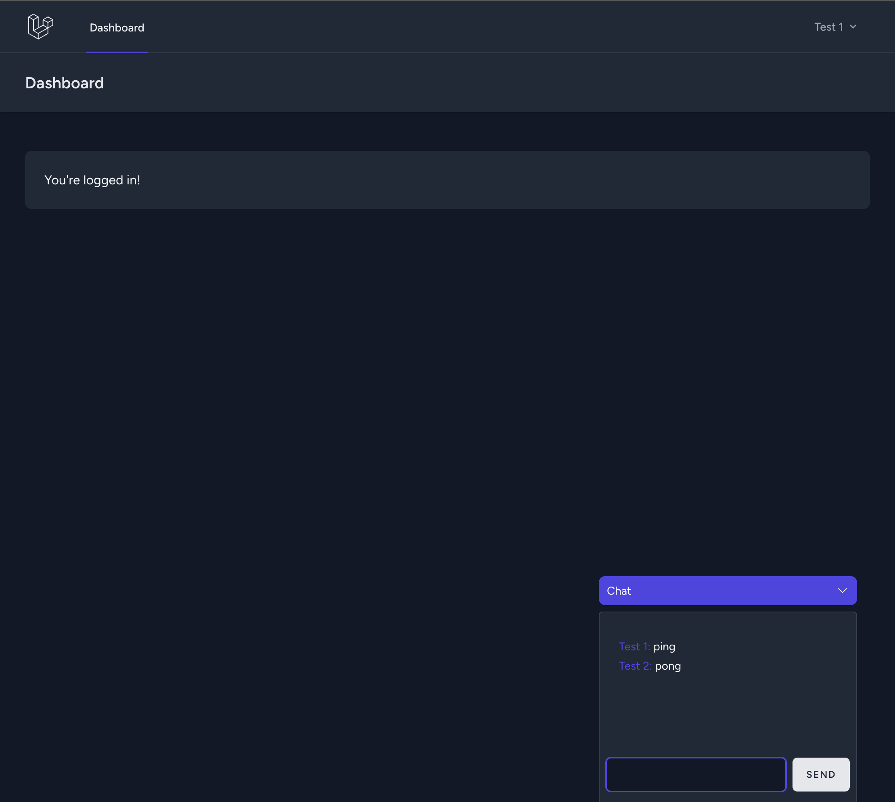

## Real Time Chat With Laravel Volt and Reverb

### Run App locally
- clone repository
- `cd reverb-chat`
- `cp .env.example .env`
- `composer install`
- `./vendor/bin/sail up -d`
- `./vendor/bin/sail artisan migrate`
- `./vendor/bin/sail npm install`
- `./vendor/bin/sail npm run build`
